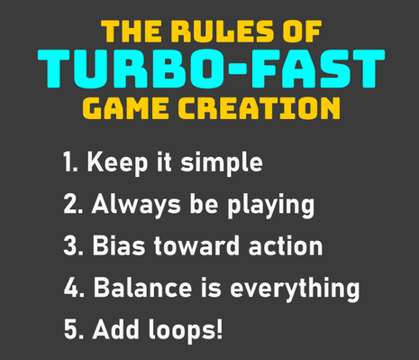
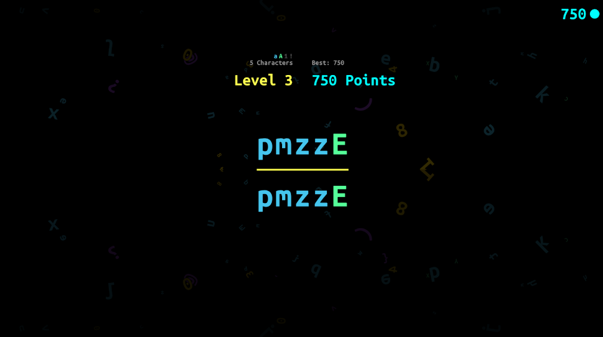
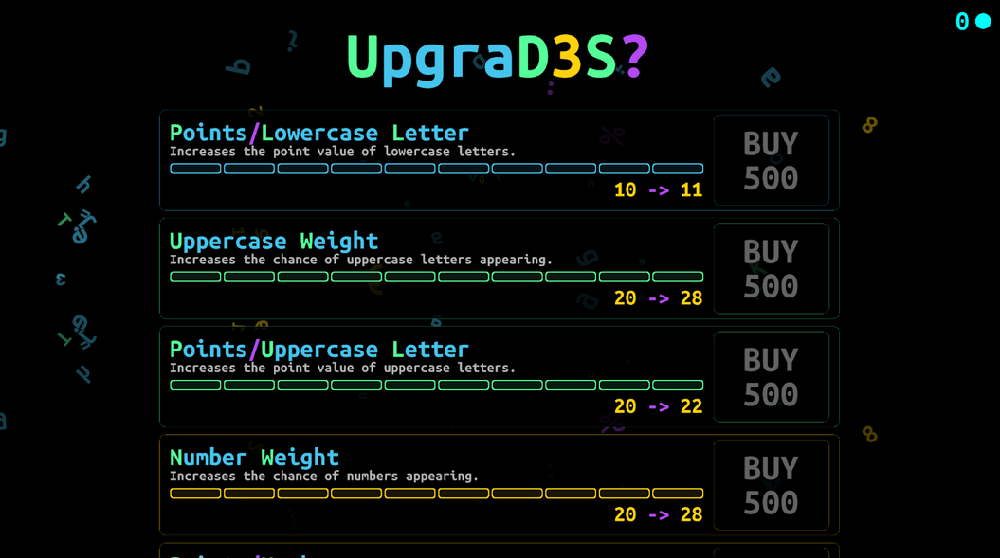
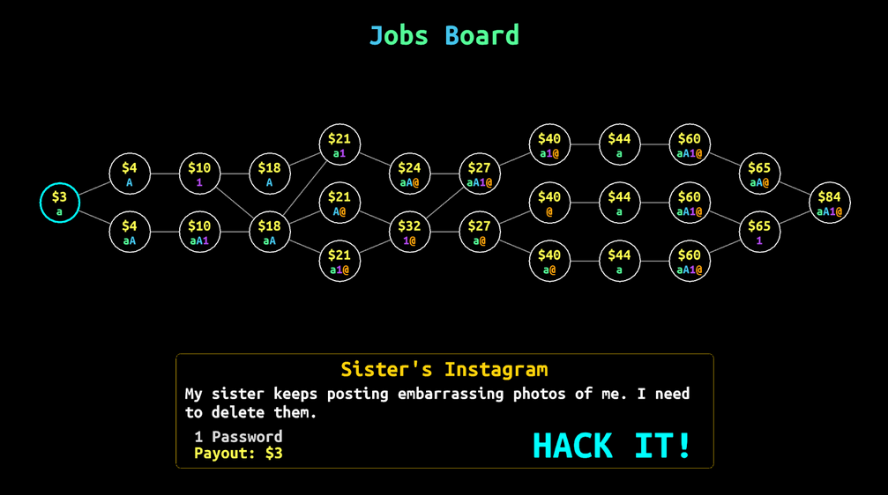
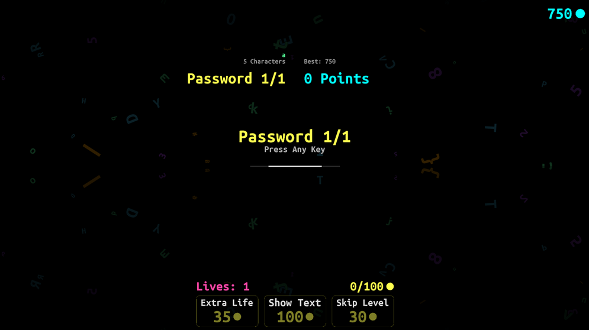

What happens when you need to make a game, but you only have ten hours to get it done? Oh, and you’re solo. Can you make anything good? Can you make anything AT ALL?

This spring I hopped into the Saint Louis Game Developers’ [2025 Spring Game Jam](https://itch.io/jam/stlgamedev-spring-jam/entries). I was subject to quite a few constraints, as I kinda decided to jump in at the last minute. Even though the jam was a week long, I was still pretty busy with [Crashlands 2](https://www.bscotch.net/games/crashlands-2) development, so I didn’t have too much time to spare -- just a few hours here and there. My normal jam buddies at Bscotch were all busy as well, and I didn’t want to rope in a new teammate because of my chaotic schedule.

So I decided to FLY SOLO like a BALD EAGLE! Or... a bald guy, anyway.

As a programmer with no artist, I had to go all the way down to the fundamentals of game jamming. I had to follow... **THE BSCOTCH RULES OF TURBO FAST GAME CREATION**.

<!--more-->

 

After doing dozens upon dozens of game jams with my crew at Bscotch over the past decade, we’ve developed a set of internal rules for making small games super fast. We’ve used these rules to make just about every small project we’ve done, ranging from an [MMO in a weekend](https://www.youtube.com/watch?v=PDcVUgHoS-g&ab_channel=ButterscotchShenanigans), to a series of jams where we made a game from start to finish in 8 hours, every Monday, for 6 weeks. [Flop Rocket](https://www.youtube.com/watch?v=RmlwAgf7o_A), one of our games that went on to get a front page feature on the App Store, was the product of that particular jam.

If you want to make games really fast, using THE RULES is a great way to do it. So let’s get into them!

## Rule 1: Keep it Simple
There’s no such thing as a “good” game idea. Just about any game idea can turn into a great game; it ultimately comes down to execution, polish, and balance. Alternatively, just about any game idea can turn into a terrible game for the same reason. Therefore, ideas don’t actually matter much.

So in a game jam, don’t stress about making some grandiose design. Literally whatever you first think of is good enough as a starting point. In fact, the longer you spend on your idea, the less likely you’ll be able to finish it. Don’t give yourself time to blow out the scope; just settle on the most basic of mechanics, and start building.

For this jam the theme was “Remember.” So my initial design phase took about 3 minutes, and it went like this:

- “Remember”... It should be a memory game... of some type.
- What could I have people remember? I don’t have an artist, so pictures are out.
- I could try to program different shapes, and maybe use different colors and combinations of shapes? But then I’d have to figure out how to let people choose shapes to match... That’s a lot of UI work.
- Actually, I could just use letters, numbers, and symbols. Then I don’t have to make any visuals for them. They already exist!
- I’ll start by just showing random strings of characters briefly, and then the player has to remember the characters and type them out. Each time they get it right, they move on to the next round, which is more challenging... somehow.

That’s it! Within a few minutes I was done with my idea and began building.

 

## Rule 2: Always Be Playing
Next, your goal should be to get the game to its most basic playable state as fast as possible. When we do jams, we try to have the base mechanic of the game up and running within the first couple hours. This is because once you can play the game, you can start iterating on its design. If you can’t play it, you’re just iterating on hypotheticals, and you’ll generally be wrong. So getting to “playable” as fast as possible is the first goal.

For my jam game, I had the basic mechanic of “see some characters and then type them in to earn points” in about an hour. Once I had that hooked up, I just sat down and played it for about 15 minutes and tried to evaluate how it felt. And you know what? It **SUCKED**. But why? What was missing? What would be fun to add?

Because I was able to play it, I was able to begin asking -- and then answering -- these questions.

## Rule 3: Bias Toward Action
As you begin playing and iterating on your game, you might be tempted to just throw it out and try something else, because whatever you were doing just isn’t working. Don’t do that. TRUST IN THE PROCESS.

Taking a bunch of time to undo work that’s already been done, debate the merits of ideas, and agree on a new path will suck up precious time that you SIMPLY DON’T HAVE. Instead, bias toward action that moves the game forward somehow, ideally in a way that involves very little thinking or debate.

To do that, play your game and try to feel what it needs *right now*, and implement the first thing that comes to mind. This approach can feel a little weird, because you won’t be doing things in what most people would consider the “proper order.”

In my case, once I was able to play my game, I thought, “This is boring.” There were a lot of reasons why it was boring, but the most obvious one for me was that there were no animations or sound effects. In that moment, that was the first thing that came to mind, which means it was the thing I should do next.

So I grabbed a few basic sound effects and some music, and I slapped some easing animations in there. None of it was particularly good, but it was passable, and it moved the game into a better state. Once I had those hooked in, I would be better able to evaluate what comes next.

In other words, don’t stress about what you *should* be doing. Don’t plan ahead. Just live in the moment, feel out what the game needs *right now*, and move forward on that. If you’re moving your game forward, you’re good. If you’re thinking and debating, you’re not building anything.

## Rule 4: Balance is Everything
Balance is the thing that actually makes a game what it is. As a simple example, let’s say your jam game is just “I’m a person with a sword fighting waves of enemies.” It’s a basic idea, but with the right balance, it can be incredibly fun. There are a bunch of balance “levers” that you can pull:

- Your movement speed (affects how hard it is to avoid damage or close the gap to your target)
- Enemy movement speed (affects how easy it is to escape)
- Your attack speed (affects how quickly you can put out damage, or potentially get swings in between enemy attacks)
- Enemy attack speed (affects how hard it is to avoid damage, as well as deal damage in between enemy attacks)
- How much health you have (increases or decreases the penalty for making mistakes)
- Enemy health (affects how quickly you can dispatch enemies)
- Your hitbox size (affects ease of evading damage)
- Enemy hitbox size (affects how easy it is to land hits)
- How frequently enemies spawn into the arena (puts pressure on the player to continue killing them or risk being overwhelmed)

In this scenario, you can very easily make a variety of game experiences *only by changing these variables* -- some good, some bad. Here are some examples:

- Fast enemies that are difficult to dodge, combined with low player health? You get unavoidably one-shot all the time. That sucks and will frustrate players!
- Fast enemy respawn timer with medium enemy health and fast player movement and fast player attacks? Now you’ve got a hack-and-slash where you’re mowing down tons of enemy waves. Super fun!
- Very few enemies that are slow-moving, big, and have lots of health, but deal huge damage to you? Now you’re fighting giants, which could be very cool!
- One or two enemies at a time, with somewhat slow player animations and somewhat slow enemy animations? Now you’ve got a souls-like. Nice!
- Enemies that die super easily and also don’t do much damage to you, and they spawn very slowly? Now your player is bored and just waiting around. BOOOO!

Setting up your game in a way that allows you to quickly tweak with these variables is extremely important, because you can continue adjusting these as your game’s mechanics coalesce. As you do so, your game will reveal what it wants to be, and you can carry it forward to that destination.

In game design, balance is *everything*. Without it, you don’t have a game -- you just have a pile of forgettable mechanics. I’ve lost count of how many times I’ve participated in game jams where I’ve seen someone put together a game that has all the right pieces, but the balance is so out of whack it just faceplants right at the finish line.

Although on the surface, my game of “look at characters, memorize them, and type them back” doesn’t seem like it would have many balance levers. But as it turns out... it does! Here are just a few examples:

- How long you get to see the characters to memorize them before they disappear
- What types of characters get shown. The more types of characters, the harder it is to remember.
- The total number of characters the player is expected to remember.
- How many characters get shown at a time. If you just get shown 8 characters right away, it’s hard to remember. But if I give you three characters first, then four, then, five, etc... you can build up your memory of the full phrase.
- How many points each character is worth

Even with hardly any mechanics, I was still able to get my tiny game into a decent place just by fiddling with the above.

## Rule 5: Add Loops
Once you have your game’s base mechanics and you’ve played with the balance levers enough to get it feeling fun, it’s time to take it up a notch by adding LOOPS.

Loops are the core concept that makes games “sticky.” One we’re all probably familiar with is “Get a crappy sword, then use it to defeat a boss who drops a better sword, which you can use to fight a harder boss.” It’s a “loop” because the player is performing the same type of activity for the same type of reward over and over, and the reward allows the player to complete the same type of objective more effectively. But the game gets more challenging, the numbers get bigger, and the scenario feels higher-stakes as the player advances.

When doing a game jam, you generally want to reach a point where you’re able to start adding loops toward the latter 1/3 of the jam. This gives plenty of time to come up with fun ways to have the player re-engage with your game as they move through the loops.

My jam game didn’t seem like something that could have loops at first, because hey, it’s just a game about typing characters. But you can add loops to just about anything, so I gave it a shot anyway.

I set it up so that as the player progresses through longer phrases, they earn more points per character. I also made different types of characters be worth more, with lowercase letters being the lowest, then uppercase letters, then numbers, and finally symbols being worth the most points.

Then, I let the player reinvest those points into an “Upgrades” system, which increases the point value of different types of characters, as well as increases the rate at which they appear. With these basic loops, the player will be able to reach a higher high score simply by reinvesting the points they earn.

 

And that’s it! Ultimately, [my game](https://bscotchseth.itch.io/refl3ct) ended up being REALLY basic. It had just a few fundamental pieces -- a core mechanic, a scoreboard, and some loops. By the ten hour mark, I was out of time and had to submit my game. In terms of fun, I’d say my game was fine. Not great, and definitely not complete, but a decent starting point for the amount of time invested. All thanks to following THE RULES!

### Keep Going?
Just because a jam is over, doesn’t mean you need to toss your game in the garbage. Sometimes it can be fun to keep going, just to see where you end up.

As a caveat, I’m not personally interested in the type of game that I made. I don’t even think this game has a genre to speak of. Is there a market for it? Could I sell it? Certainly not in its current state, as it’s just a weird little game I slapped together on a whim. But still, I can’t help but think to myself, “Where might this lead?”

So I’ve been chipping away at it, still following **THE RULES**, just to see what pops out the other side. I’ve only put about 12 more hours into the game since the jam, but so far I’ve added the following:

- The game has been reframed as a “hacker” game where you’re brute-forcing passwords to perform jobs for money. At first, you’re hacking basic stuff like printers at the local library as a prank. In the end, you’ll hack THE SIMULATION THAT WE ALL LIVE IN. You know, by memorizing passwords.
- A “jobs map” that lets you move through different jobs to crack different passwords for different cash amounts
- A “shop” where you can spend your cash on a few key things, such as “retries” (if you make a mistake, you can type the character again), “reveals” (be shown the password again), or level skips.
- Tab characters that complete the password
- Carets (^) that grant free retries
- Shiny characters that are worth bonus points
- Gold characters that grant cash
- Ghost characters that transform into whatever you type
- An “autocorrect” system that grants a chance to have a mistake get transformed into the correct character
- Loops for all of the above

 

*New jobs board where people pay you to hack stuff.* 

 

*Updated in-game view with a shop at the bottom to spend your money.* 

 

*Upgrade screen with new mechanics added since the jam.* 

I also have ideas scribbled down for adding a “scripts” system, where you can find scripts in a given run that help you get through tougher passwords, more mechanics, “boss fight” passwords, and more. All I’m doing is playing the game for a little while, jotting down what comes to mind as “the next thing the game needs,” and then working on that thing.

As I’ve implemented each of these, the game is starting to come into its own and feel more and more like something with actual potential instead of something just serviceable. I still don’t know where it’s going, and I don’t know if it’ll ever be fun enough to release as a full game, but that’s not really the point right now.

For now, it’s all about the journey. So I’m just going to keep going!

