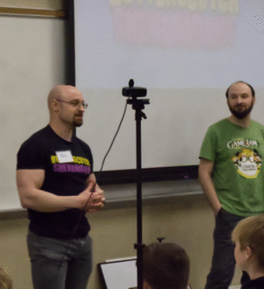
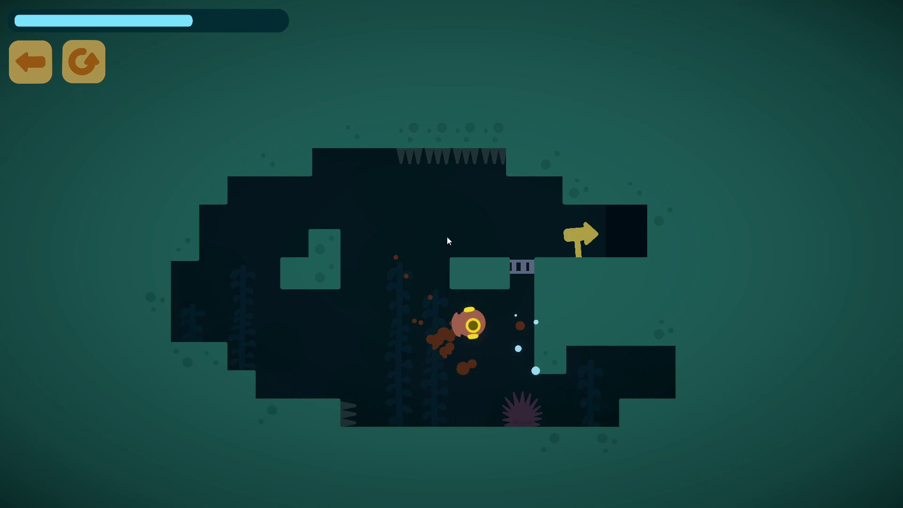
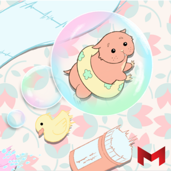
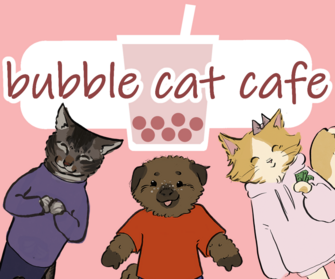
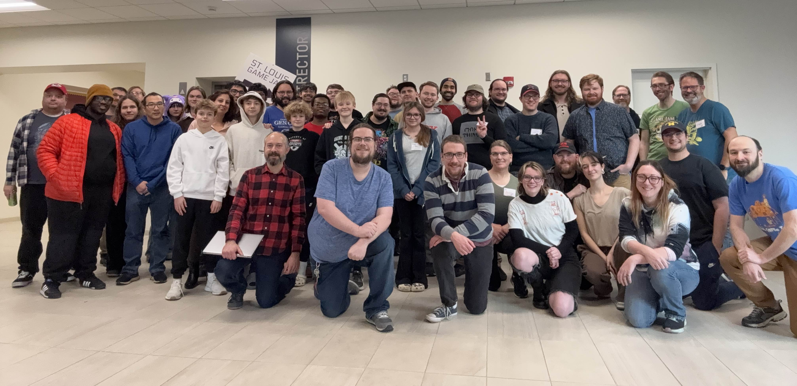
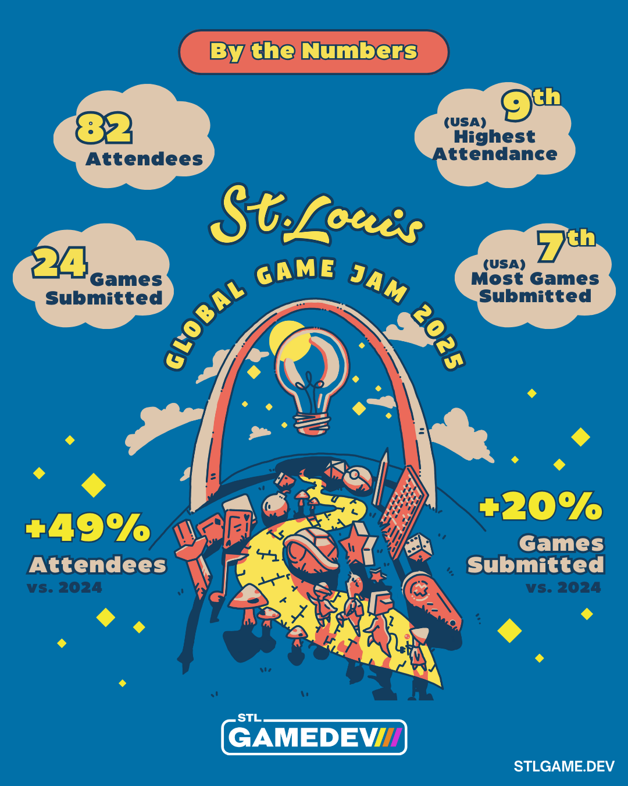
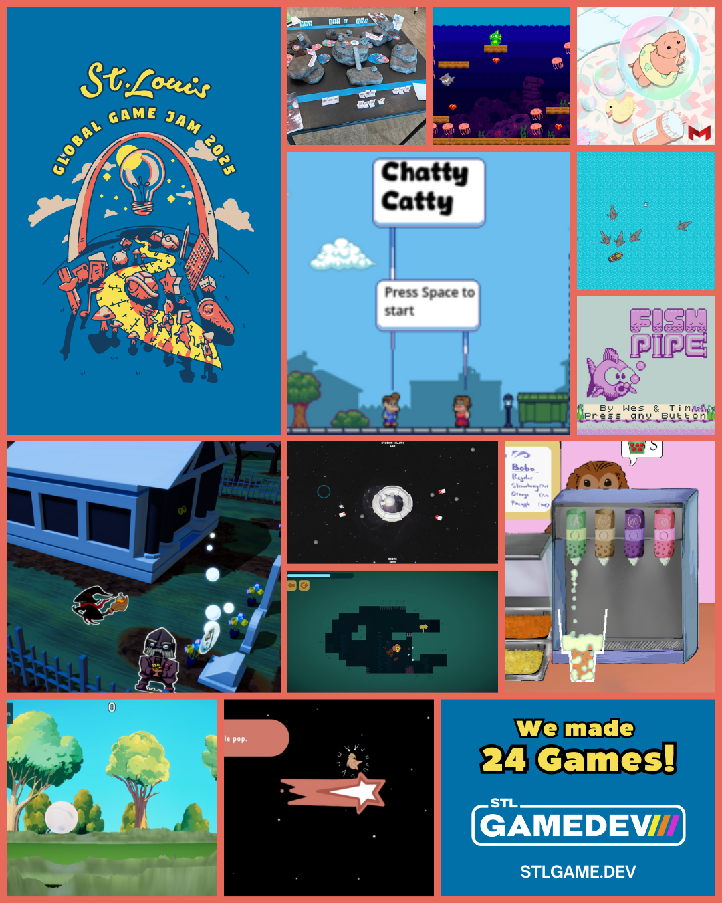
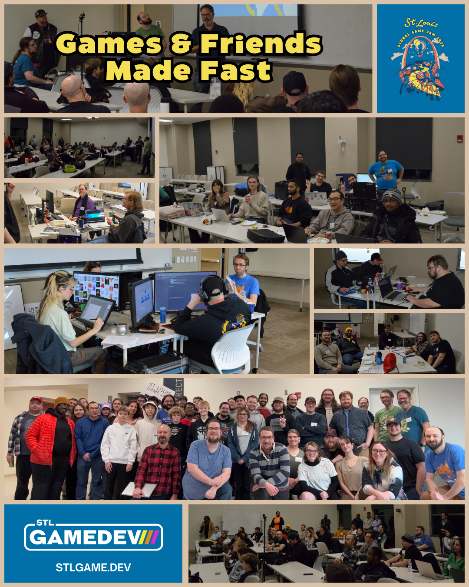

Now that it’s been a few weeks and the dust has settled after Global Game Jam 2025, we’d like to take a moment to reflect on the experience of organizing the event.

This was the 15th Global Game Jam we have run locally, and at least our 28th Game Jam event (so many we’ve kind of lost count)- although it was the first time for a few of our team members.

Overall, we feel like the event was a huge success! Let’s talk about it!

## What is a Game Jam?

A Game Jam is an event where participants have a limited amount of time to  build a game based around the theme of that jam, which is announced at the start of the event.

Speed and teamwork are both important to being able to successfully finish a game during a game jam. It is a great place to learn about keeping the scope of your project small and manageable, and some of the other often surprising aspects of game development besides just the code, the art, and the music.

The [Global Game Jam](https://globalgamejam.org/) is a world-wide event where thousands of participants, across hundreds of locations over the entire world are all given the same theme and make games using that theme over the course of 48 hours.

This year’s theme was **“Bubble”**, so each of the games that was made had to do something with bubbles in some way.

## The Jam Location

The St Louis Global Game Jam 2025 was held in Anheuser Busch Hall at UMSL. Thanks to the IT and Cybersecurity Club and the College of Business Administration, we were able to use 4 classrooms on-site for the entire weekend. They were spacious, clean, and comfortable, and allowed anyone who wanted to work together on location a space with power and wi-fi for the entire length of the event. Our generous sponsors for the event, Lewis Rice and [Butterscotch Shenanigans](https://www.bscotch.net/), allowed us to provide plenty of snacks, drinks, and a meal each day for everyone.

Seth Coster, from Butterscotch Shenanigans, gave a key note speech during the event kick-off presentation.

## Statistics

This year, our site had **82 participants**. This put us at the **9th highest attendance** in the country.

Our jammers submitted **24 games** and we had the **7th highest number of games** at a site in the country.

Our attendance **increased by 49%** and we made **20% more games** locally this year than in 2024!!

As part of the entire Global Game Jam, there were **35,000 jammers** across **795 sites** in **97 countries** who submitted a total of **12,000 games**, which was a 20% increase from 2024!

## Impact

The Global Game Jam - and game jams in general - are fun, exciting, and a great way to learn about working in a team, and how to finish a game in a short amount of time. But you don’t have to take my word for it: here are some testimonials from participants at our site this year:

> <i class="i fa-sharp-duotone fa-quote-left fa-2x"></i> As my first time seriously participating in a game jam, let alone one in person, I wasn't sure what to expect, but it was cool listening to everyone work and problem solve alongside each other. I think my favorite game that was made there was "The Three Bubble Problem" because of its great use of vector art and great puzzle design!

&mdash; <cite>[Brendan](https://bsky.app/profile/looloopaa.bsky.social), artist on [Greedy Guppy](https://globalgamejam.org/games/2025/greedy-guppy-1)</cite>

> <i class="i fa-sharp-duotone fa-quote-left fa-2x"></i> The 2025 Global Game Jam was my first in-person game jam that I ever attended. I had attended a virtual one in 2022, but it was not nearly as fun and rewarding as this one! I got to work with a great team, share my love of music and games with other like-minded folks, and see what my other STL peeps were working on. I was overwhelmed by the sheer passion of the community and kind patience that the veterans showed to newcomers wanting to shadow and try new things. All in all, it was a fantastically motivating experience, and I can’t wait for the next one!

&mdash; <cite>[Lazarus Richardson](https://allmylinks.com/lazthecomposer), composer on [Chatty Catty](https://globalgamejam.org/games/2025/chatty-catty-9)</cite>

> <i class="i fa-sharp-duotone fa-quote-left fa-2x"></i> The 2025 Global Game Jam was so much fun. It has reinvigorated my efforts into game development and, this time, I was able to introduce my daughter to it and she loved it!

&mdash; <cite>Pedro, programmer on [Bubble Apocalypse](https://globalgamejam.org/games/2025/bubble-apocalypse-7)</cite>

> <i class="i fa-sharp-duotone fa-quote-left fa-2x"></i> I attended Global Game Jam 2025 hosted by STLGameDev, met a bunch of friendly people and got to be part of an enthusiastic group of game makers. We had a blast making our game Greedy Guppy, an underwater platformer, for this year’s jam! There were so many other awesome games, too, like The Three Bubble Problem, Chatty Catty and Lost, and… well you get the idea. I had a great time!

&mdash; <cite>[Erica](https://bsky.app/profile/muserica.bsky.social), composer on [Greedy Guppy](https://globalgamejam.org/games/2025/greedy-guppy-1)</cite>

> <i class="i fa-sharp-duotone fa-quote-left fa-2x"></i> Global Game Jam is such an awesome chance to break out of your comfort zone and try out new tools, techniques, and game design ideas. It's like a creativity explosion when everyone puts their minds together and you can go beyond where you could alone. Plus, there’s something magical about making games alongside the entire world.

&mdash; <cite>[Kit Kitsis](https://linktr.ee/ilikethepixies), artist on [Lost](https://globalgamejam.org/games/2025/lost-1)</cite>

> <i class="i fa-sharp-duotone fa-quote-left fa-2x"></i> We were wonderfully accommodated for, given a good space (and good food) while we worked on our project.

&mdash; <cite>[Tony Wojnar](https://x.com/tony_wojnar), artist on [Chatty Catty](https://globalgamejam.org/games/2025/chatty-catty-9)</cite>

> <i class="i fa-sharp-duotone fa-quote-left fa-2x"></i> I had a blast at the 2025 GGJ! It was great to be back on the UMSL campus where we got to work alongside a bunch of other passionate game devs.

&mdash; <cite>Julia Bernett, artist on [In Memoriam](https://globalgamejam.org/games/2025/memoriam-6)</cite>

## Recommendations

There were a *lot* of games made this year - **24** at our location alone!

You can check out all of the games that were made in St Louis [here](https://globalgamejam.org/group/12052/games)

We hope you take the time to try out as many as possible, but here are a few that we recommend to start with:

  

    <a class="card align-items-center text-center link-body-emphasis text-decoration-none" target="_blank" href="https://globalgamejam.org/games/2025/foamwalker-5">
      

        
        

          <h6 class="card-title" >The Three Bubble Problem</h6>
        

      

    </a>
  

  

    <a class="align-items-center text-center link-body-emphasis text-decoration-none" target="_blank" href="https://globalgamejam.org/games/2025/matt-sudz-goin-ham-bathtime-breakout-1">
      

        
        

          <h6 class="card-title" >Matt Sudz Goin' Ham - Bathtime Breakout</h6>
        

      

    </a>
  

  

    <a class="align-items-center text-center link-body-emphasis text-decoration-none" target="_blank" href="https://globalgamejam.org/games/2025/bubble-cat-cafe-4">  
      

        
        

          <h6 class="card-title" >Bubble Cat Cafe</h6>
        

      

    </a>
  

## Conclusion

Running a large event like this for 48 hours straight is a tremendous amount of work for our small team, but we wouldn’t do it if it wasn’t rewarding.  Seeing so many local creators come together to make such amazing things over a weekend is extremely fulfilling for us and we’re happy to be able to help facilitate it happening.  A huge thanks to our community for participating in this event and making it a great one!

[STLGameDev](https://stlgame.dev) is dedicated to bringing people passionate about game development together and helping facilitate their creativity. The GGJ is just the start of all the things we have planned for this year.

Coming up in the immediate future is our [GameDev Social](https://www.meetup.com/st-louis-game-developers/events/304799158/) event for February, and our [Share & Play Q1](https://www.meetup.com/st-louis-game-developers/events/305690663/) event!

We are also hoping to be able to run another local game jam later this year, so keep checking back for details on that!
If you would like to join us, you can join our [Discord](https://discord.com/invite/mTMKpre/) and our [Meetup.com](https://www.meetup.com/st-louis-game-developers/) and participate in our upcoming events.

You can also follow us on social media: [Facebook](https://www.facebook.com/groups/stlgamedev), [Twitter](https://x.com/stlgamedev), [Bluesky](https://bsky.app/profile/stlgame.dev), and [Instagram](https://www.instagram.com/stlgamedev)

## Infographics!

Share these infographics on social media!

