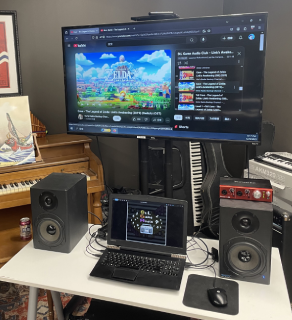
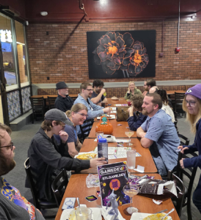
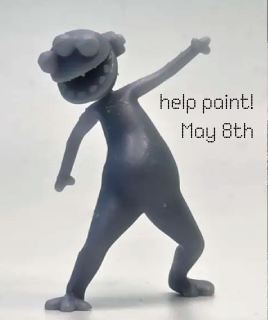
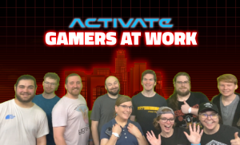

The game development scene in St. Louis is more active, more creative, and more supportive than ever before! March and April have been an absolute whirlwind of events, talks, and get-togethers – giving local developers bunches of opportunities to grow, share, and step out of their comfort zones. Whether you’re new to the scene or a seasoned dev, there’s never been a better time to get involved!

***

## Catching Up On Talks

Members from our community have been giving talks and sharing their expertise!

### 🎓 Mascoutah High School’s Career Day

On **Friday, March 21st**, STLGameDev’s *Dan Eichling* and *Chris Taylor* took center stage at **Mascoutah High School’s Career Day**, introducing students to the world of video game development and the broader tech industry. From career paths to the impact of AI on creative fields, they gave students a realistic look at what it’s like to build games for a living – and more importantly, how to get started.

Their goal was to give high school students a clearer vision of what it means to actually do game development as a job and supply them with resources that could lead them to future success as a game developer.

### 🧠 STL Tech Week

On **Tuesday, April 1st**, *Dan Eichling*, *Wes Ehrlichman*, and *Adam Coster* hosted a panel at **STL Tech Week**, diving into how coding education can be made more enjoyable through game development. 

They talked about how although it's easier than ever before now to learn game development with up-to-date documentation being available online, tools update that much quicker too. *YouTube* has become a powerful tool in learning anything one might need, but when on the cutting edge finding the correct document might be tougher.

They have evolved their learning practices by being comfortable not knowing what they were doing and pushing forward despite it. Game development is about being a problem solver. Staying curious and always experimenting to see what happens is part of being a developer. 

They also talked about soft skills in game development – the most important being communication. A team is most efficient when everyone is transparent and aware of their own abilities.

### 🎥 Kinematifest

Fast forward to **April 6th**, where *Keith Bruns* and *Kelsey Watkins* represented the game design career track at *Webster University*’s annual **Kinematifest**. Keith delivered a standout Keynote Address, followed by a Q&A with creative leaders across disciplines. They touched on remote work realities, the value of mastering the fundamentals, and the importance of being flexible — doing what needs to be done, not just what feels creatively satisfying.

## We've Been Hosting Regular Monthly Meetups!

We try to host at least one event per month, in addition to our Monthly Social Event!

### 🎧 Audio Club

The **Audio Club** hosted a listening party for *Link's Awakening* in March, sparking great conversation around composition, mood, and nostalgia in game audio. Looking ahead, April’s meetup will be a Show & Tell session on [Saturday, April 26th](https://www.meetup.com/st-louis-game-developers/events/307179227/). Got a demo or a track you’ve been working on? **Bring it in!** It’s a great opportunity to get thoughtful feedback and hear what others in the community are building.

### 🎮 Game Club

**Game Club** continues to dive deep into the art of game design. In March, the group explored the weird and wonderful world of *Juice Galaxy*—a surreal indie title brimming with chaotic charm and Gen Z energy. Coming up on [Monday, April 28th](https://www.meetup.com/st-louis-game-developers/events/307278952/), the club will be discussing the critically acclaimed *Hyper Light Drifter*. Whether you’ve played it before or are experiencing it for the first time, it’s a perfect chance to analyze its storytelling, aesthetic, and mechanics with fellow devs.

### 💬 STLGameDev Social

At the **Game Dev Social** this month at Dirty 20, we celebrated the name day of our beloved purple "gamelian", Plorp. What started as a lighthearted joke turned into a full-blown tribute. Members designed a 3D model of Plorp, printed miniatures, and are planning to bring paints for next month’s meetup. If you're into painting minis, come lend a brush at the next month's Social on [Thursday, May 8th](https://www.meetup.com/st-louis-game-developers/events/307069688/). We need your help assembling the first Plorp battalion!

### 🏃 Dev Night Out

Last month's **Dev Night Out** at Activate Games was a hit - check out our members [dodging, throwing, jumping (seriously - Nathan gets some mad air)](https://www.instagram.com/p/DIePHdUx_5y/)! Thanks to Tyler for taking action footage! It was a great reminder that while we love making games, sometimes it’s even better to just play and let loose. More community nights like this are already in the works.

***

Our community has been crushing it with new releases, projects, and collaborations. Want to see what everyone’s working on? [**Sign up to receive the Saint Louis Game Developer RoundUp in your email every month**](https://mailchi.mp/1ffd5b9734df/sign-up-for-monthly-st-louis-game-developer-roundups-in-your-email) to stay in the loop with all the incredible work coming out of STL.

See you at the next event 👾
