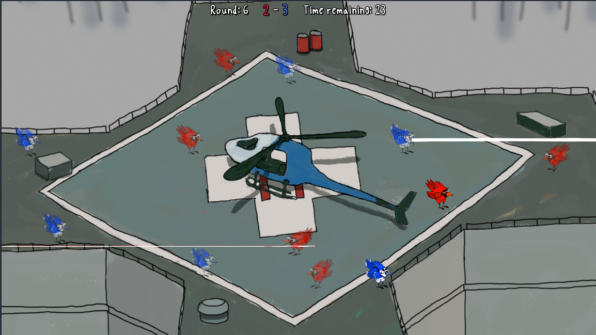
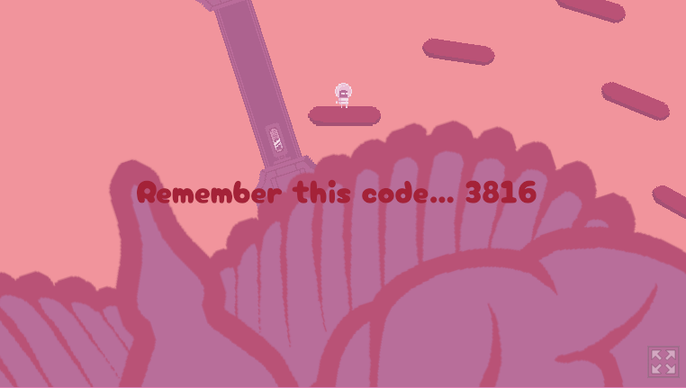
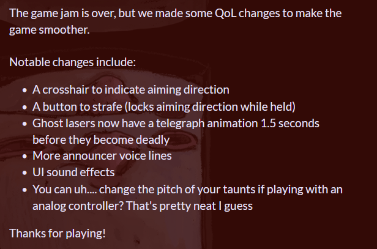

Game jams are where creativity, chaos, and collaboration collide. This year’s [Spring Game Jam](https://itch.io/jam/stlgamedev-spring-jam/entries) challenged teams to build games virtually in just ten days. From artists picking up new tools to programmers juggling ambitious ideas, participants walked away with hard-won lessons — and more excitement for their next jam.

This year's theme was "Remember":

<iframe width="560" height="315" src="https://www.youtube.com/embed/q619iNg0xms?si=lFzgGNPB4K1hCrDm" title="YouTube video player" frameborder="0" allow="accelerometer; autoplay; clipboard-write; encrypted-media; gyroscope; picture-in-picture; web-share" referrerpolicy="strict-origin-when-cross-origin" allowfullscreen></iframe>

We collected insights from many developers who took part, and their reflections reveal the key ingredients (and pitfalls) of a successful jam. Whether you’re a veteran jammer or considering your first event, here’s what they learned:

## 🔎 Finding Motivation and First Impressions 

For many, the jam was an energizing shift from solo work or long-term projects. 

<cite>[Lucy the Pirate](https://lucythepirate.itch.io/), programmer on [Birds of a Feather](https://lucythepirate.itch.io/birds-of-a-feather), captured the excitement:</cite>

<i class="i fa-sharp-duotone fa-quote-left fa-2x"></i> I was surprised at how much fun I had working with people I hadn’t met before. Seeing the game evolve so quickly was way more motivating than solo dev! 

<cite>[Miniscule](https://miniscule.itch.io/), another programmer on [Birds of a Feather](https://lucythepirate.itch.io/birds-of-a-feather), shared how the jam pushed him to try new workflows:</cite> 

<i class="i fa-sharp-duotone fa-quote-left fa-2x"></i> It was my first time using Godot and GDScript. The jam was a great excuse to get out of my comfort zone in Unity and learn something new.

<cite>[Kit Kitsis](https://www.instagram.com/ilikethepixies/), artist on [Neuronaut](https://shredderct.itch.io/neuronaut), highlighted the power of pre-existing team chemistry:</cite>

<i class="i fa-sharp-duotone fa-quote-left fa-2x"></i> It was my first jam with a team I was already part of. Teams can be the hardest part of a jam sometimes, so it was a relief that this time, it just… worked.

 

[*Birds of a Feather*](https://lucythepirate.itch.io/birds-of-a-feather)

## 🛠️ Planning and Managing Scope

While creativity is essential, good planning often determines whether a jam ends with a finished game or a half-baked prototype. 

<cite>[Sabrex](https://itch.io/profile/sabrex15), designer on [Henry Hart and the Puzzle Piece Killer](https://neitherworld.itch.io/henry-hart-the-puzzle-piece-killer), emphasized the value of front-loaded planning:</cite> 

<i class="i fa-sharp-duotone fa-quote-left fa-2x"></i> We spent the first three days choosing a genre, story, art style, and defining scope. That let each member work effectively on their own tasks — planning paid off several times over.

<cite>azeTrom, music and design contributor on Next Aisle Over, summed up a universal jam lesson:</cite> 

<i class="i fa-sharp-duotone fa-quote-left fa-2x"></i> Stick to a smaller scope. It sounds obvious, but I’m still learning what ‘appropriate’ means. We had amazing ideas but no time left for playtesting.

<cite>Sound designer [Walpang](https://soundcloud.com/walter-sie) for Birds of a Feather echoed the need to avoid over-theorizing:</cite> 

<i class="i fa-sharp-duotone fa-quote-left fa-2x"></i> Don’t spend too long planning in the abstract. Get to development quickly so you have time for polish.

<iframe width="100%" height="300" scrolling="no" frameborder="no" allow="autoplay" src="https://w.soundcloud.com/player/?url=https%3A//api.soundcloud.com/tracks/2106562470&color=%23ff5500&auto_play=false&hide_related=false&show_comments=true&show_user=true&show_reposts=false&show_teaser=true&visual=true"></iframe>
<a href="https://soundcloud.com/dorian_kavadlo" title="Dorian Kavadlo" target="_blank" style="color: #cccccc; text-decoration: none;">Dorian Kavadlo</a> · <a href="https://soundcloud.com/dorian_kavadlo/shopping-spree-next-aisle-over" title="Shopping Spree - Next Aisle Over" target="_blank" style="color: #cccccc; text-decoration: none;">Shopping Spree - Next Aisle Over</a>

## 🎨 Growing Technical Skills and Personal Development

Game jams are famous for pushing developers out of their comfort zones. Colin’s first experience with Godot led to solving a major bug the team had struggled with for days — a confidence boost for anyone trying new tools mid-jam. 

<cite>[Soobly](https://soobly.itch.io/), 3D artist on [Henry Hart and the Puzzle Piece Killer](https://neitherworld.itch.io/henry-hart-the-puzzle-piece-killer), dove into Unreal for the first time:</cite> 

<i class="i fa-sharp-duotone fa-quote-left fa-2x"></i> I learned how Unreal’s material system works — it reminded me of Blender’s nodes. It was surprising how fast I could create props and materials once I got into it. Keeping consistent file names also helped me stay organized.

<cite>[DoodleDupe](https://doodledupe.itch.io/), artist on Next Aisle Over, discovered how small habits affect productivity:</cite> 

<i class="i fa-sharp-duotone fa-quote-left fa-2x"></i> I need to measure task time better and communicate with my team about it. Also, listening to music keeps me moving faster than podcasts or video essays.

 

[*Henry Hart and the Puzzle Piece Killer*](https://neitherworld.itch.io/henry-hart-the-puzzle-piece-killer)

## 🗨️ Teamwork and Communication

Several participants highlighted that teamwork made the difference between frustration and success. 

<cite>Kit noted about her teammate, Shredder:</cite> 

<i class="i fa-sharp-duotone fa-quote-left fa-2x"></i> This jam showed me how important practicing teamwork can be. Everyone’s skills meshed together, and communication kept things moving.

<cite>Sabrex described how effective task division boosted their team’s progress:</cite> 

<i class="i fa-sharp-duotone fa-quote-left fa-2x"></i> Each member focused on their specialty. It was amazing to see how much we could achieve in a day when working efficiently.”

<cite>azeTrom praised his team’s dynamic:</cite> 

<i class="i fa-sharp-duotone fa-quote-left fa-2x"></i> The team was phenomenal. Communication was 10/10, everyone’s work fit together so well — it was just fun!

 

[*Neuronaut*](https://shredderct.itch.io/neuronaut)

## ⏳ Crunch, Challenges, and Room for Improvement

Of course, not everything went perfectly. Crunch in the final days was a common thread. 

<cite>Lucy the Pirate mentioned her post-crunch burnout:</cite> 

<i class="i fa-sharp-duotone fa-quote-left fa-2x"></i> There was a bit of crunch the last two days that left me in a ‘I don’t want to think about game dev’ mood for a bit, but I’m proud we finished.

<cite>[Shredder](https://shredderct.itch.io/) described a compressed timeline for Neuronaut:</cite> 

<i class="i fa-sharp-duotone fa-quote-left fa-2x"></i> Two of our team dropped out, so it was just Kit and me. I had to throw everything together the day of submission, but Kit did a wonderful job on the art.

<cite>azeTrom’s biggest regret was the lack of playtesting:</cite> 

<i class="i fa-sharp-duotone fa-quote-left fa-2x"></i> We finished, but the game never reached a playable state because we didn’t set aside time to test and iterate.

## 🎉 Wins, Progress, and Positive Outcomes

Despite challenges, teams celebrated significant achievements. Many completed playable builds, like Birds of a Feather, which continued improving their game even after the jam by adding features like laser warnings and strafing mechanics:

 

The biggest win? **Nearly everyone said they were excited for the next jam.**

## ✅ Takeaways for Future Jams

The collective wisdom from Spring Jam 2025 can be distilled into three key points:

- **Plan and scope wisely** — ambitious ideas are great, but finishing something fun and polished matters more.
- **Communicate early and often** — clarity keeps motivation high and reduces last-minute chaos.
- **Leave time for testing** — a few hours of playtesting can turn a buggy build into a great game.

Game jams are opportunities to learn, grow, and create something special with others. If you haven’t tried one yet, consider joining us, the STL Game Dev community, for the next event, happening soon!

Have your own jam stories? Share them on the Discord!
See you at the next event! 
