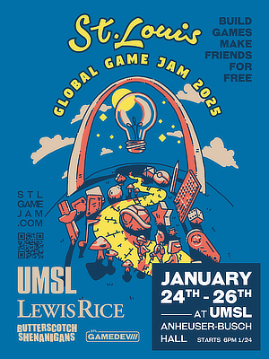

## Announcing: Global Game Jam 2025

### Global Game Jam 2025

- **What:**
  : 48 hours to make a game and then show it off - solo, or with a team!

- **Where:**
  : University of Missouri St Louis (UMSL) - Anheuser Busch Hall

- **When:**
  : January 24-26th 2025

- **Registration:**
  : [<i class="i fa-brands fa-meetup me-1"></i> MeetUp.com](https://www.meetup.com/st-louis-game-developers/events/297210316/?utm_medium=referral&utm_campaign=share-btn_savedevents_share_modal&utm_source=link)
  : [Global Game Jam Website](https://globalgamejam.org/jam-sites/2025/university-missouri-st-louis-it-and-cybersecurity-club-hosting-stlgamedev)

- **Cost:**
  : FREE!

<small>We appologize for this very late annoucement. Due to complications beyond our control, it took much longer to finalize this event before we could share it.</small>

<small><strong>Please</strong> consider helping us get the word out by sharing this post or the included flyer so that we can try to get as large of a turn out a possible! And make sure you register ASAP so that we have a good headcount!</small>

The [Global Game Jam (GGJ)](https://globalgamejam.org/) is a 48-hour hackathon-style event that occurs simultaneously at hundreds of locations around the world. Game developers from all ages, experience, and skillsets gather, form teams, receive a theme, and then create games together within 48 hours. There are no winners– instead there is unbridled creativity and collaboration.

<i class="i fa-sharp-duotone fa-regular fa-triangle-exclamation fa-2x"></i>

We are asking everyone to please <a href="https://www.meetup.com/st-louis-game-developers/events/297210316/?utm_medium=referral&utm_campaign=share-btn_savedevents_share_modal&utm_source=link">sign-up for the event</a> as soon as possible so that we can get an accurate attendee count for the event!

This year, we are returning to UMSL for the event!

The event this year will feature:

- Comfortable classrooms to work from with power and wi-fi!
- Free food, drinks, and snacks!
- Around-the-clock access - jam for the whole 48-hours straight, uninterupted if you want!
- Nearby Free Parking available each day on campus!

<i class="i fa-sharp-duotone fa-solid fa-people-group fa-2x"></i>

Everyone of any skill level is welcome to come and participate!

### Schedule

- **Friday, Jan 24th**
  : **5:00 pm** - Registration Opens - Room 004
  : **6:00 pm** - Welcoming Ceremony, Keynote Address, and Theme Reveal - Room 004
  : **6:30 pm** - Rooms 002, 003, 004, and 005 are available for Jamming!
- **Saturday, Jan 25th**
  : **All Day** - Jam!
  : **3:00 pm** - Game Page Creation Due
- **Sunday, Jan 26th**
  : **All Day** - Jam!
  : **3:00 pm** - Game Submissions Close!
  : **5:00 pm** - Game Sharing and Closing Ceremony - Room 004
  : **6:00 pm** - Clean-up and go home!

We look forward to making something awesome with you!

### Flier

Share this flier with your friends and colleagues!

[Download Full Size Flier](images/GGJ25-flier.png)