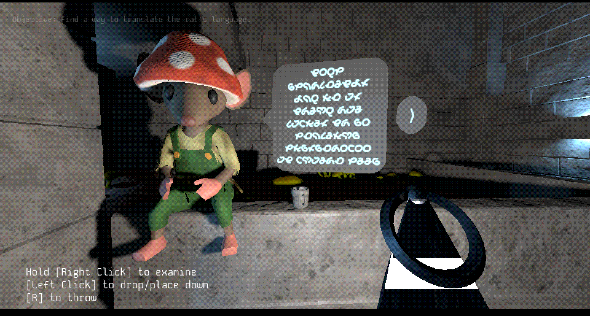
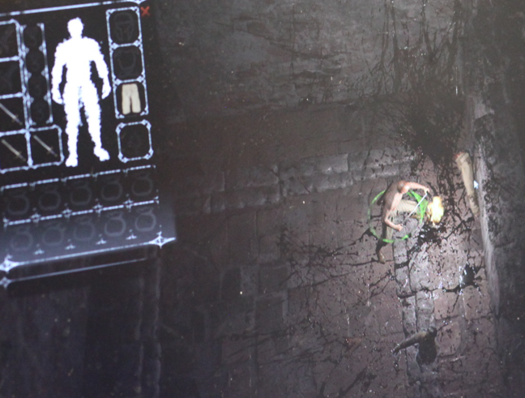
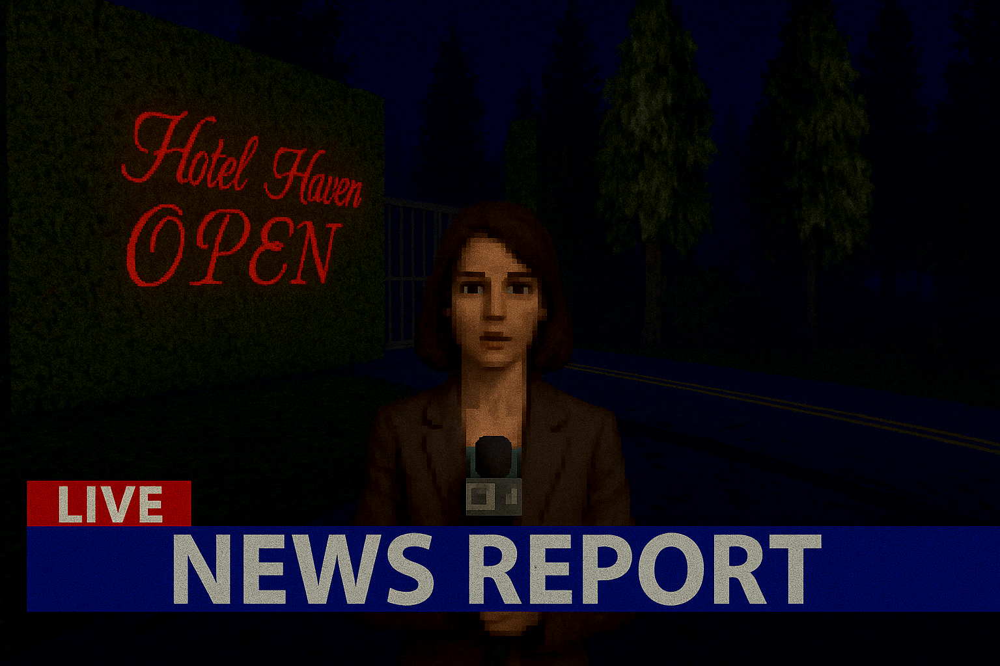
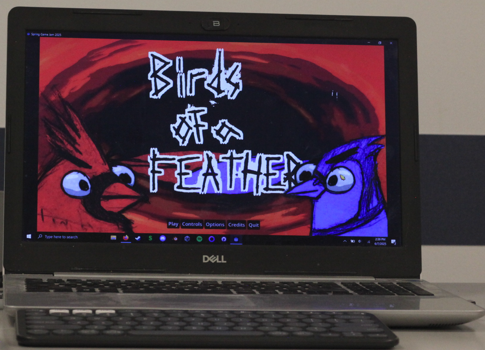
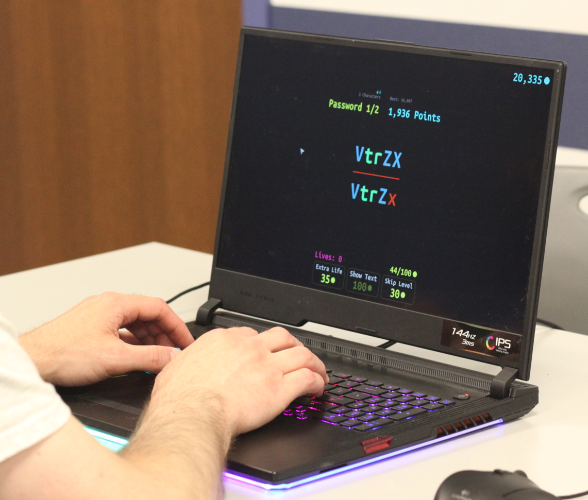
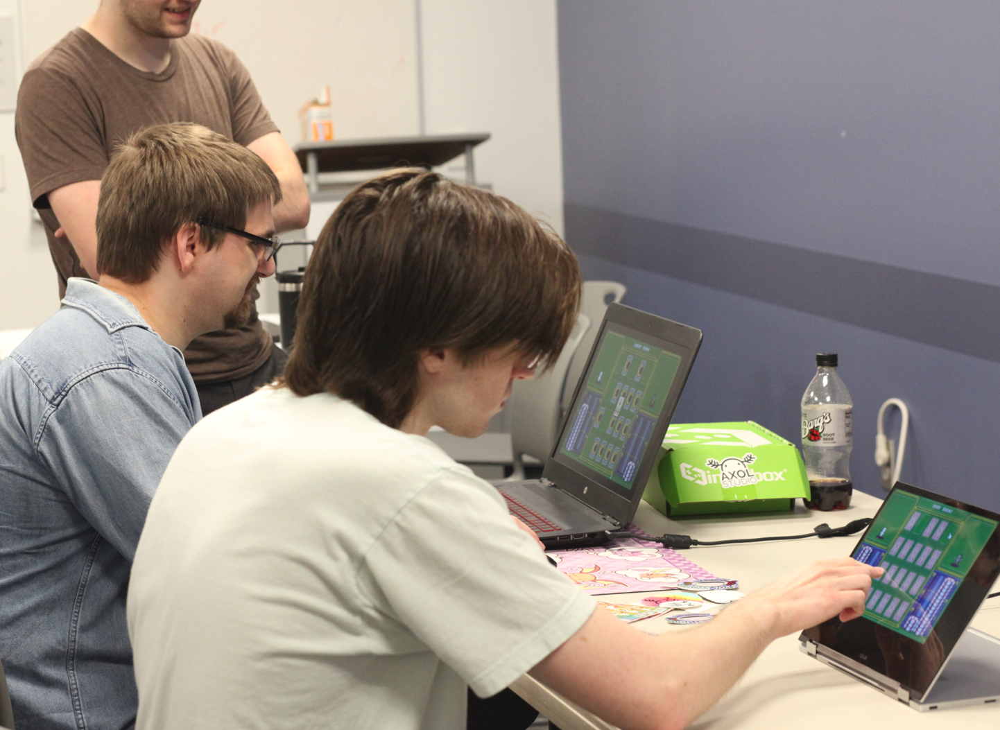
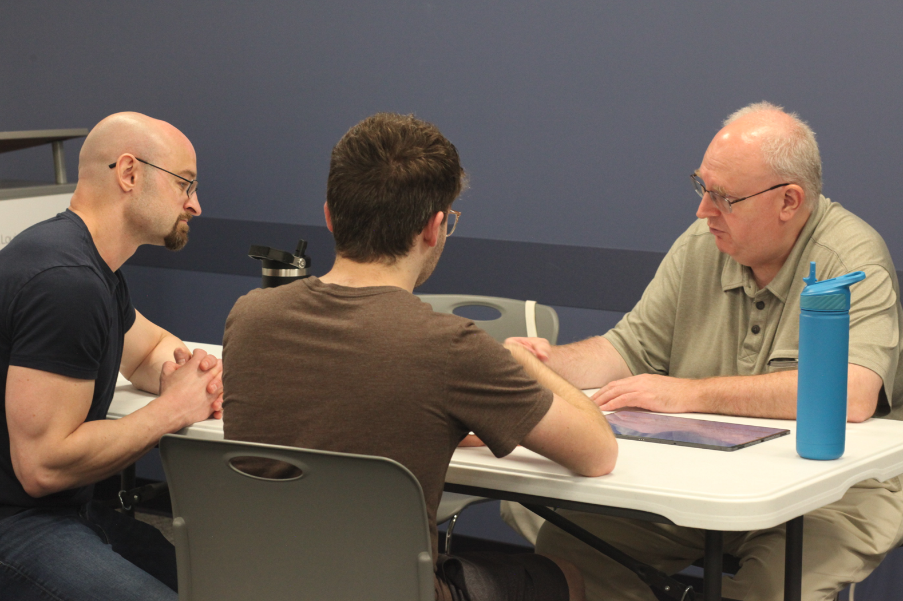

The Q2 Share and Play featured eight games, ranging from games made in ten hours to passion projects made over the course of two years! 

A huge thank you to everyone who came out to see these incredible games! If you didn't get a chance to play these titles, many of them are free to play right now on [itch.io](https://itch.io/jam/stlgamedev-spring-jam/entries)!

***

## ✨ Here are the eight games that were featured:

- *Luke Puchner-Hardman* has been working on an *Untitled* 3D puzzle game in Godot for a year! Specifically, a puzzle game about setting up a computer network with relays and programmable hubs. Read the manual to learn the inputs and break through the doors holding you back!

***

- *Seamus Mcfarlane* featured *Grovel*, a game he has been working on for two and a half years in Unity - it's a top-down soulslike with lots of personality and exploding corpses!  

***

- *Sam/Soobly* previewed the upcoming survival horror game, *Ascent*. Programmed in Unity, the crisp textures and static cameras are a love letter to playstation-era Silent Hill. 

***

- *Colin Schulte* showcased the chaotic [*Birds of a Feather*](https://lucythepirate.itch.io/birds-of-a-feather), a top-down shooter game made by a 4 person team in 10 days for the 2025 Spring Game Jam! Each round as the players run around as laser beam toting birds, the game records their actions and replays them as an ally in the next round. As more and more birds and beams fill the screen, players must remember hazards from past rounds and strategically position themselves to gain the advantage! 

***

- *Seth Coster* made [*ReFL3cT*](https://bscotchseth.itch.io/refl3ct) in ten hours with no artist for the 2025 Spring Jam! Using the UI framework from their new title Crashlands 2, he was able to make a password memorization game with categories of characters! He has written an in-depth dive into what all he learned from the experience that you can read here! 

***

- *Axol Studio* showcased the addicting [*Fish & Chips*](https://axolstudio.itch.io/fish-n-chips). Made in HaxeFlixel in 10 days for the Spring Game Jam, this game is a memory-matching, turn based combat showdown will have you playing again and again! 

***

- *Tony Wojnar* showcased Dribble 2, a platforming game built specifically for mobile devices, where players swipe in the direction they want to toss Dribble. Guide Dribble through treacherous and trippy worlds to save his friends!

***

- *Bill Buss* has been developing his Basic Math Game - a math tutor app optimized to teach basic math problems to students as quickly as possible with as little friction between answering problems.

***

Our community has been crushing it with new releases, projects, and collaborations. Want to see what everyone’s working on? [**Sign up to receive the Saint Louis Game Developer RoundUp in your email every month**](https://mailchi.mp/1ffd5b9734df/sign-up-for-monthly-st-louis-game-developer-roundups-in-your-email) to stay in the loop with all the incredible work coming out of STL.
