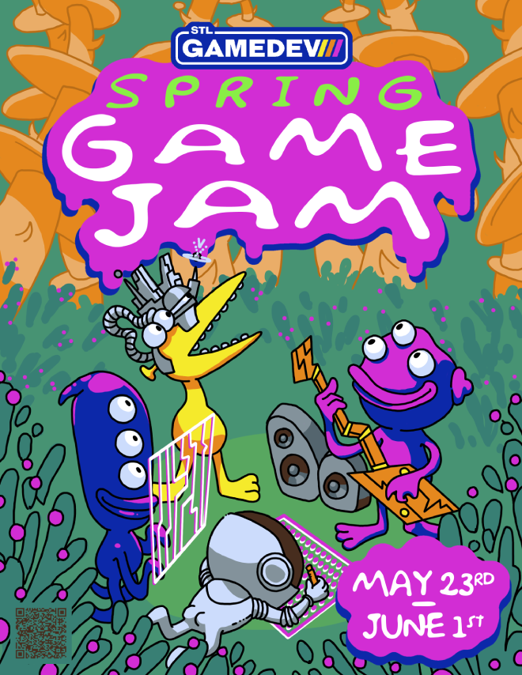

## Announcing: The 2025 Spring Game Jam

Spring is almost over already and we're overdue for another game jam! So team up with local creators and make a game over a few weekends (and the week in between) for the **Spring Game Jam**!  

## Details

- **What:**
  : 10 days to make a game and then show it off - solo, or with a team!

- **When:**
  : May 23-June 1st 2025

- **Where:**
  : The theme will be revealed on Twitch, as well as showcasing the submitted games
  : On Saturday March 24th from 12-5, there is an open [Game Jam Work Session](https://www.meetup.com/st-louis-game-developers/events/307748696/) at Grand Glaize Library

- **Registration:**
  : [Itch.io](https://itch.io/jam/stlgamedev-spring-jam)
  : [<i class="i fa-brands fa-meetup me-1"></i> MeetUp.com](https://www.meetup.com/st-louis-game-developers/events/307433670/)

- **Cost:**
  : FREE!

**This jam will be virtual only.** [SIGN UP ON ITCH.IO](https://itch.io/jam/stlgamedev-spring-jam)!
We would like to encourage everyone to collaborate with local devs in person if possible. We think jamming in person is just more fun. To find teammates and stay up to date on event details, **join our [Discord server](https://discord.gg/mTMKpre)**! If you must, you can work with remote friends as well. Students, hobbyists, and professionals are all welcome to submit games.

All participants must abide by the [STLGameDev Community Guidelines](https://stlgame.dev/about/#community-guidelines).

Everyone of any skill level is welcome to participate!

<i class="i fa-sharp-duotone fa-regular fa-triangle-exclamation fa-2x"></i>

We are asking everyone to please <a href="https://itch.io/jam/stlgamedev-spring-jam">sign-up for the event on Itch.io</a> as soon as possible so that we can get an accurate attendee count for the event!

### Schedule

- **Friday, May 23rd**
  : **6:00 pm** - Keynote & Theme Reveal streamed online on [Twitch](https://www.twitch.tv/STLGameDev)
- **Saturday, May 24th**
  : **12:00 pm - 5:00 pm** - Game Jam Work Session at Grand Glaize Library
- **Sunday, May 25th - Saturday, June 1st**
  : **All Day** - Jam away!
- **Sunday, June 1st**
  : **4:00 pm** - Game submission deadline
  : **6:00 pm** - Game demos streamed online on [Twitch](https://www.twitch.tv/STLGameDev)

We look forward to making something awesome with you!

### Flier

Share this with your friends and colleagues!

*super cool promo illustration by [Timconceivable](https://timconceivable.itch.io/) and Kit Kitsis [@iLikeThePixies](https://linktr.ee/ilikethepixies)
